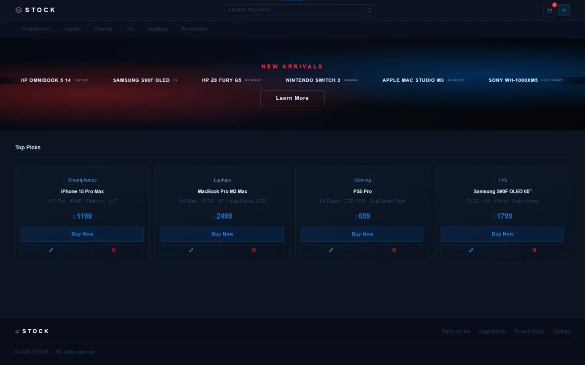

# STOCK

## About

Full Stack E-commerce Platform 

## Live Demo

## Features

- **6 Categories** — Smartphones, Laptops, Gaming, TVs, Desktops, Accessories
- **Real-time Search** — Instant search with suggestions
- **Admin Panel** — Create, update and delete products
- **New Arrivals** — Animated hero banner with latest products
- **Responsive** — Optimised for all screen sizes

## Usage

- Browse products by category
- Use search bar to find specific products
- Admin manages products via **+** button

## Tech Stack

## License

MIT License
